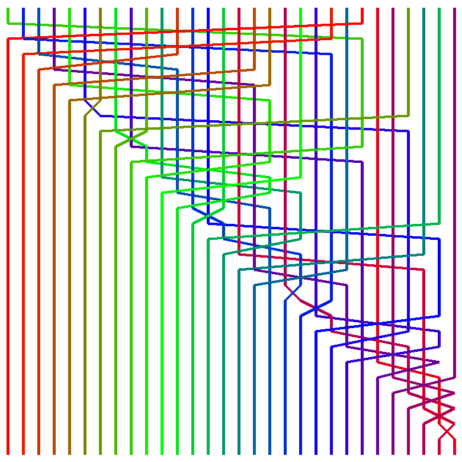

# Static Visualiser for compariosn Sorting Algorithms

## Overview
Static Visualiser for comparison Sorting Algorithms (**SVAS** for short) is a exactly what the name sugests, a tool for visualizing comparison sorting algorithms.   
A static visualisation of a sorting algorithm is a graphic (see the examples below), of the states a vector goes through when it is being sorted by a specific algorithm.

## Instalation
In order to use SVAS make sure you have a version of `python 3.x` installed and `Pillow`.

## To Do:
I intend to add a GIF animation option for the SortAnimater class.

## Examples
Here are some examples for the currently implemented sorting algorithms:  
Note that MergeSort is a modified version that I made in order to make it a comparison sorting algorithm, the running time is O(N^2).

1. BubbleSort:  

 

2. SelectionSort:  

 

3. InsertionSort:  

 

4. MergeSort:  

 

5. QuickSort:  

 

6. HeapSort:  

 

7. ShellSort:  

 

8. CombSort:  

 

More to be added soon!  
If you want to help implementing more sorting algorithms I left a note at the end of the [sorting algorithm library](sorting_algorithms.py) that tells you the format of the functions.
